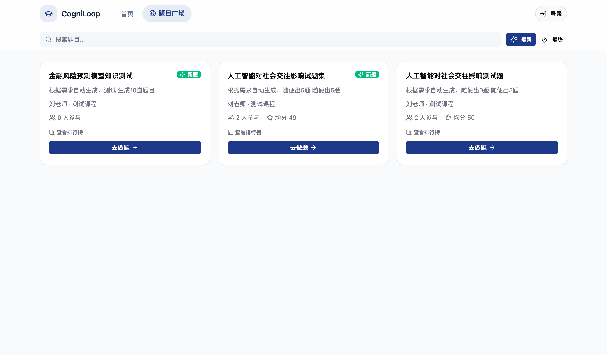
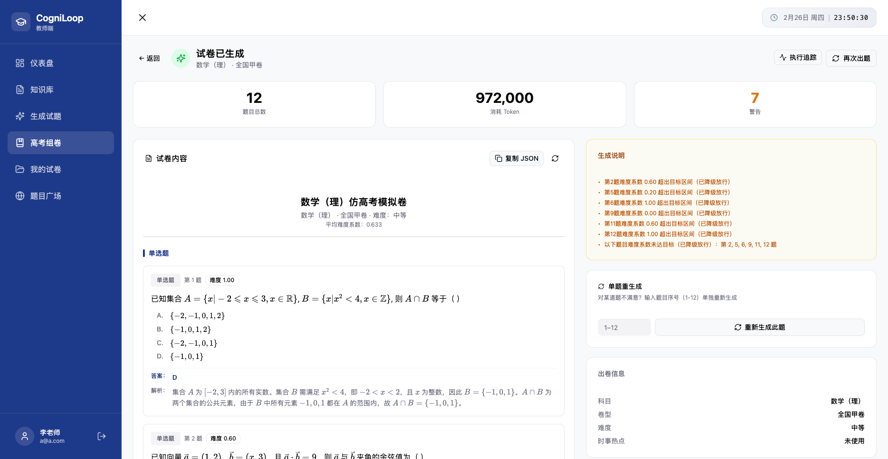
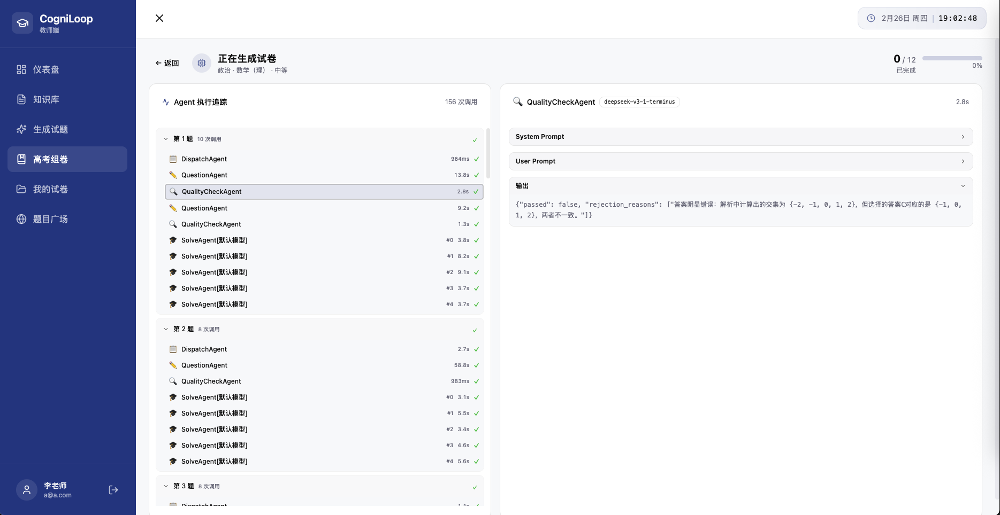

<p align="center">
  
</p>

一个智能助教系统，教师可以上传课程相关文档，根据文档内容生成试题集，并使用大模型的能力自动批改学生答案给出评分和解析。

该项目目前正在开发阶段，后续会不断完善功能和优化体验。如果您遇到任何问题，欢迎提交 issue，我很乐意帮助您！

> **声明**：本系统的核心定位是教育辅助，绝不作为任何形式的高考"押题"工具。我的初衷只是单纯地希望，无论是城市还是偏远地区的学生，都能用上先进的 AI 教育工具，体验到高质量的定制化练习。

**在线演示**：https://cogniloop.morninghao.online

## 快速开始

> 启动 CogniLoop 最简单的方式是通过 Docker Compose。在运行以下命令启动 CogniLoop 之前，请确保您的机器上已安装 [Docker](https://docs.docker.com/get-started/get-docker/)和 [Docker Compose](https://docs.docker.com/compose/install/)：

> 部署遇到的任何问题，欢迎提交 issue，我会第一时间帮助您!

一、 clone 本仓库

```bash
git clone https://github.com/itsmorninghao/CogniLoop.git
cd CogniLoop
```

二、 复制并编辑环境变量文件

```bash
cp .env.example .env
```

编辑 `.env` 文件，配置 JWT 密钥等信息（生产环境建议使用 `openssl rand -hex 32` 生成密钥）

三、 构建并启动服务

```bash
cd docker-cogniloop
docker-compose up -d --build
```

四、 首次创建超级管理员

首次访问任意地址（如 http://localhost:8000 ）时，系统会要求先创建超级管理员账户。按页面提示填写用户名、邮箱、密码等信息即可。创建完成后即可正常使用系统。

> 如需使用**高考组卷**功能，还需完成真题库导入、教师授权和 Agent 参数配置，详见 [高考组卷功能配置指南](docs/gaokao-setup.md)。

五、 配置 LLM 和 Embedding 模型

使用刚创建的管理员账号登录管理员后台 http://localhost:8000/admin/login ，在「系统配置」页面填写：

- **LLM 模型配置**：API Key、Base URL、模型名称
- **Embedding 模型配置**：API Key、Base URL、模型名称、向量维度
- **RAG 检索配置**：分块大小、分块重叠、检索数量（可保持默认值）

六、 访问应用

- 前端: http://localhost:8000
- 管理员后台: http://localhost:8000/admin/login

## 界面展示

> 产品功能持续更新，截图可能存在一定滞后，请以实际页面为准










## 技术栈

[FastAPI](https://github.com/tiangolo/fastapi) [PostgreSQL](https://github.com/postgres/postgres) [pgvector](https://github.com/pgvector/pgvector) [LangChain](https://github.com/langchain-ai/langchain) [LangGraph](https://github.com/langchain-ai/langgraph) [OpenAI](https://github.com/openai/openai-python) [React](https://github.com/facebook/react) [Vite](https://github.com/vitejs/vite) [TypeScript](https://github.com/microsoft/TypeScript) [Docker Compose](https://github.com/docker/compose)

## 开发计划

- [x] 题目广场，教师生成试题可以共享到广场，答题后参与排行榜排行
- [x] 仿高考组题组组题功能
- [ ] 根据答题情况生成学生画像，做到每位同学的每一套题都是个性化定制的，而不是千篇一律的
- [ ] 支持教师设置答题时间

## Star History

[](https://www.star-history.com/#itsmorninghao/CogniLoop&type=date&legend=top-left)

## 许可证

AGPL v3。详见 [LICENSE](LICENSE) 文件。
