# CogniLoop - 智能助教系统

一个智能助教系统，教师可以上传课程相关文档，根据文档内容生成试题集，并使用大模型的能力自动批改学生答案给出评分和解析。如果您觉得您家的熊孩子某些科目成绩不理想，不妨试试这个系统，或许能帮到您！

后续会根据答题情况生成学生画像，做到每位同学的每一套题都是个性化定制的，而不是千篇一律的。

该项目目前正在开发阶段，后续会不断完善功能和优化体验。如果您遇到任何问题，欢迎提交 issue，我很乐意帮助您！

## Docker

### 环境要求

- Docker & Docker Compose

### 部署步骤

**部署遇到的任何问题，欢迎提交 issue，我会第一时间帮助您！**

一、 clone 本仓库

```bash
git clone https://github.com/itsmorninghao/CogniLoop.git
cd CogniLoop
```

二、 复制并编辑环境变量文件

```bash
cp .env.example .env
```

编辑 `.env` 文件，配置 JWT 密钥等信息（生产环境建议使用 `openssl rand -hex 32` 生成密钥）

> PostgreSQL 数据库由 Docker Compose 自动管理，无需额外配置。
> LLM 和 Embedding 模型配置在管理员后台「系统配置」页面在线设置。

三、 构建并启动服务

```bash
cd docker-cogniloop
docker-compose up -d --build
```

四、 首次创建需要创建管理员账号

**密码是必需的**，可以通过两种方式提供：

**方式一：交互式输入密码（推荐）**

如果未通过 `--password` 参数提供密码，脚本会提示您交互式输入密码：

```bash
docker-compose exec app python scripts/create_admin.py
```

脚本会提示您输入密码并确认，密码输入时不会显示在终端。

**方式二：通过命令行参数提供密码**

```bash
docker-compose exec app python scripts/create_admin.py \
  --username admin \
  --email admin@cogniloop.local \
  --password 您的密码 \
  --name "系统管理员"
```

> **参数说明：**
>
> `--username`: 用户名（默认: `admin`）
>
> `--email`: 邮箱地址（默认: `admin@cogniloop.local`）
>
> `--password`: 登录密码（**必需**，如果不提供将通过交互式输入）
>
> `--name`: 管理员姓名（默认: `系统管理员`）

五、 配置 LLM 和 Embedding 模型

使用刚创建的管理员账号登录管理员后台 http://localhost:8000/admin/login ，在「系统配置」页面填写：

- **LLM 模型配置**：API Key、Base URL、模型名称
- **Embedding 模型配置**：API Key、Base URL、模型名称、向量维度
- **RAG 检索配置**：分块大小、分块重叠、检索数量（可保持默认值）

六、 访问应用

- 前端: http://localhost:8000
- 管理员后台: http://localhost:8000/admin/login

## 🏗️ 项目结构

```
CogniLoop/
├── backend/                    # 后端应用目录
│   ├── app/
│   │   ├── main.py            # FastAPI 应用入口
│   │   ├── core/              # 核心配置（config, database, security）
│   │   ├── models/            # SQLModel 数据模型
│   │   ├── schemas/           # Pydantic 请求/响应模型
│   │   ├── api/v1/            # API 路由
│   │   ├── rag/               # RAG 模块（embeddings, retrieval, chunking）
│   │   ├── services/          # 业务逻辑层
│   │   └── graph/             # LangGraph 工作流（题目生成、批改）
│   ├── alembic/               # 数据库迁移
│   └── tests/                 # 测试文件
├── frontend/                  # React 前端
├── docker-cogniloop/          # Docker 相关文件
├── scripts/                   # 脚本目录
├── pyproject.toml             # Python 依赖配置
└── docs/                      # 文档目录
```

## ✨ 功能特性

### 教师端

- 📚 课程管理：创建课程、生成邀请码
- 📄 知识库管理：上传文档、自动分块、向量化存储
- 📝 试题生成：自然语言描述生成试题集
- 📊 数据统计：查看课程概览、试题完成率、学生成绩

### 学生端

- 🎓 加入课程：通过邀请码加入课程
- 📖 答题系统：支持单选、多选、填空、简答题
- 🤖 智能批改：自动批改客观题，AI 批改主观题
- 📈 成绩查看：查看批改结果和反馈

### 管理员端

- 👥 用户管理：管理教师和学生账户
- 📚 课程管理：查看和管理所有课程
- 📊 系统统计：查看系统整体数据
- 🔐 管理员管理：超级管理员可管理其他管理员

## 📸 界面展示

### 首页

现代化的落地页设计，该项目的前端构建理念:简约、大气、美观。

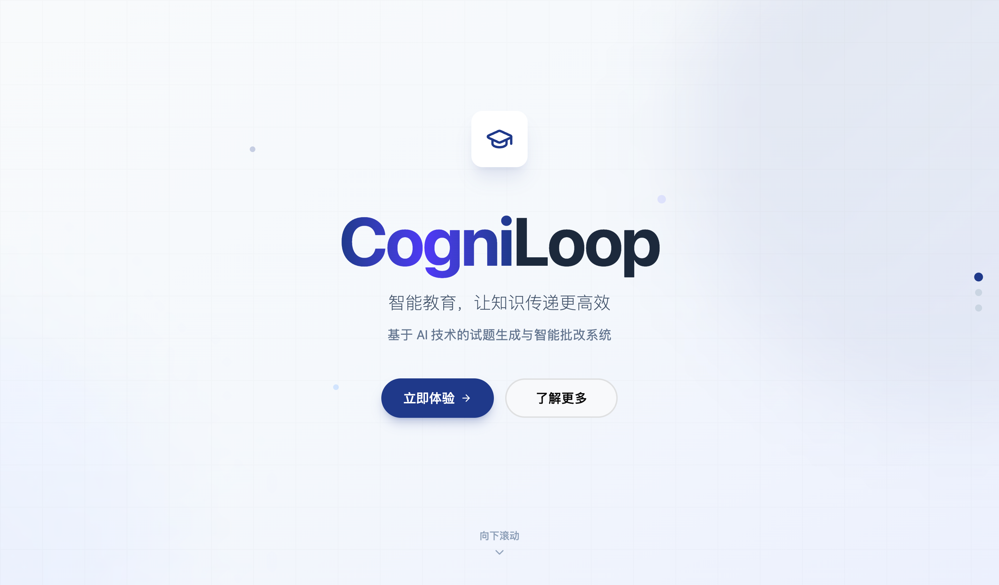

---

### 教师端

#### 仪表盘

课程概览与数据统计，一目了然掌握教学动态。

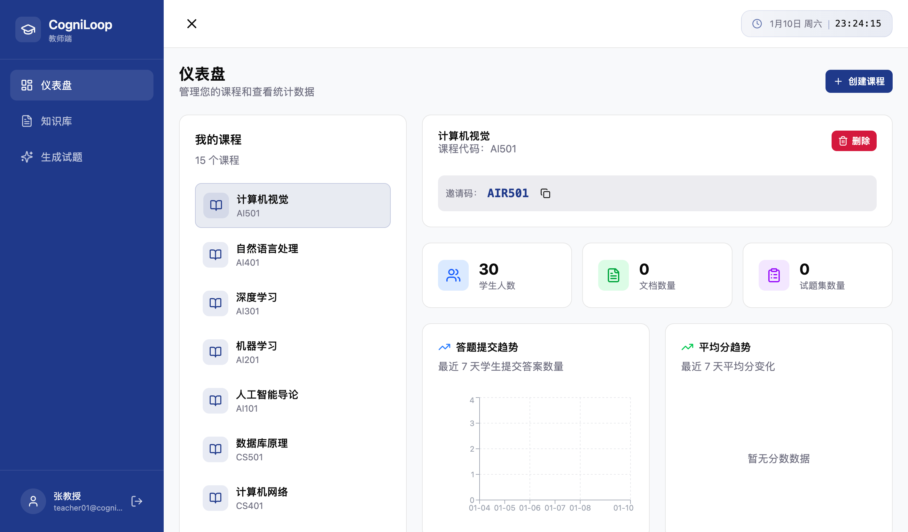

#### 知识库管理

上传 PDF、Word、Markdown、PPT 等格式文档，系统自动分块并向量化存储。

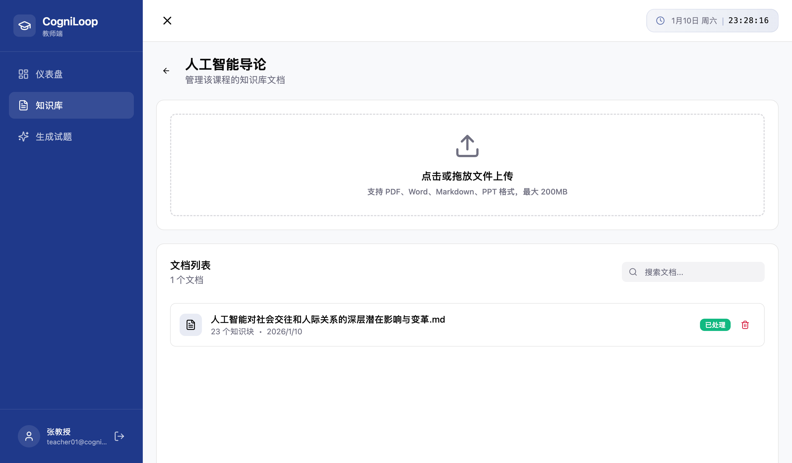

#### 试题生成

通过自然语言描述需求，AI 自动根据知识库生成试题集。

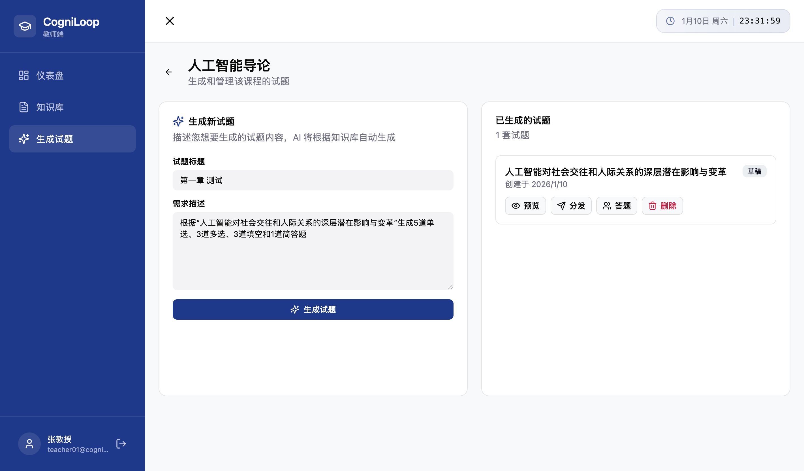

#### 试题预览 - 选择题

预览生成的单选题、多选题，支持查看正确答案。

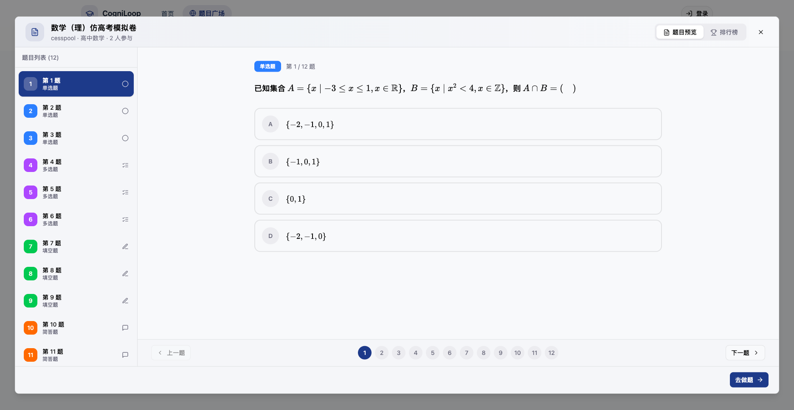

#### 试题预览 - 简答题

预览简答题的参考答案与评分要点。

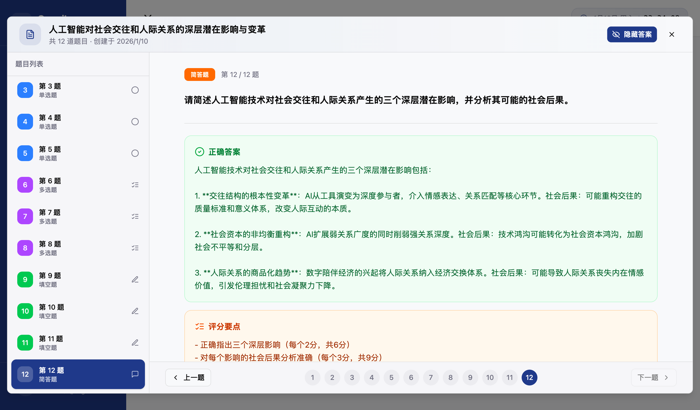

---

### 学生端

#### 我的课程

查看已加入的课程列表，支持通过邀请码加入新课程。

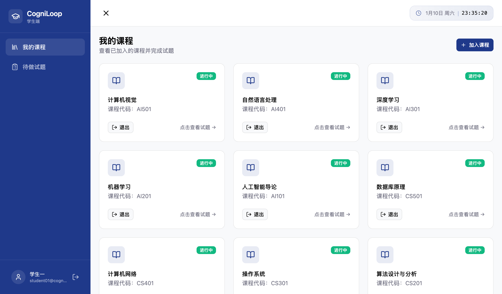

#### 待做试题

统一查看所有待完成的试题，按状态分类管理。

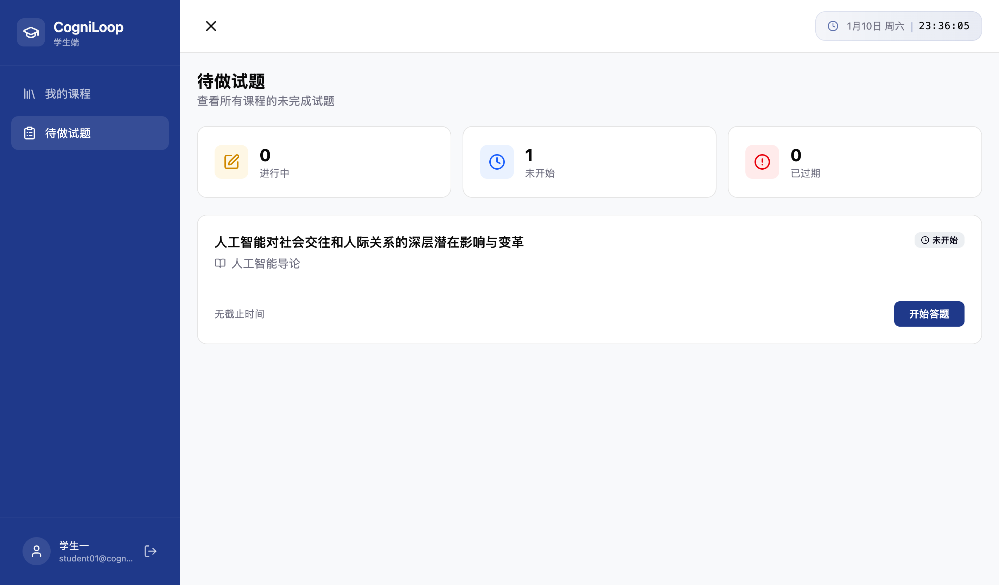

#### 答题界面

简洁的答题体验，支持题目导航、保存草稿、提交答案。

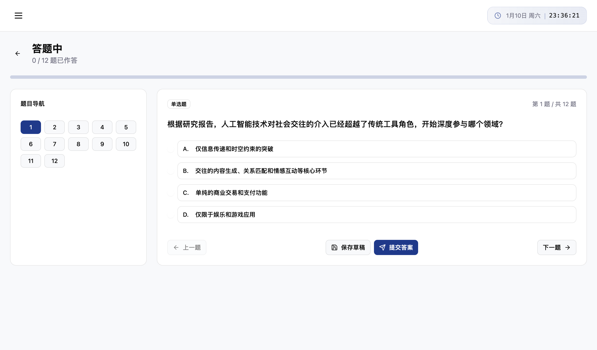

#### 批改中

答案提交后系统自动进行 AI 批改，实时显示批改状态。

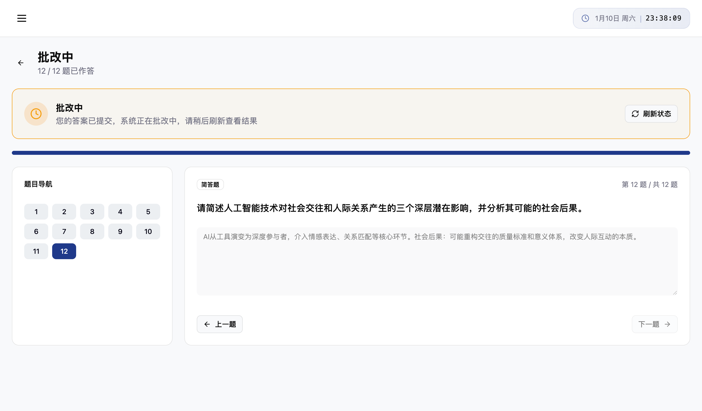

#### 成绩查看

批改完成后查看详细成绩，包含每道题的得分与 AI 反馈。

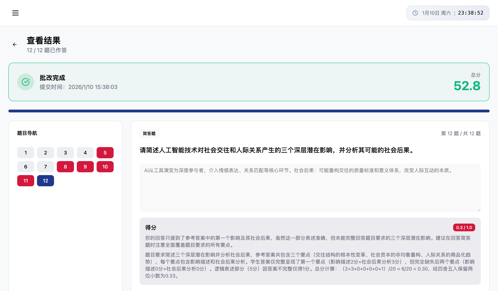

## 🛠️ 技术栈

- **后端框架**: FastAPI
- **数据库**: PostgreSQL 16 + pgvector
- **AI**: LangChain + LangGraph + OpenAI
- **前端**: React + Vite + TypeScript
- **容器化**: Docker Compose

## 开发计划

- [ ] 根据答题情况生成学生画像，做到每位同学的每一套题都是个性化定制的，而不是千篇一律的
- [ ] 支持教师设置答题时间

## 📄 许可证

MIT License
