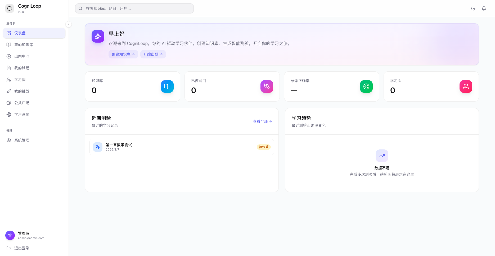

<p align="center">
  
</p>

一个以 AI 驱动的去中心化知识学习社区。用户可以创建知识库、生成个性化试题、组建学习圈子、参与挑战赛，系统会根据每位用户的学习轨迹持续优化出题策略，真正做到千人千面的自适应学习。

> **声明**：本系统的核心定位是教育辅助，绝不作为任何形式的高考"押题"工具。我的初衷只是单纯地希望，无论是城市还是偏远地区的学生，都能用上先进的 AI 教育工具，体验到高质量的定制化练习。

**在线演示**：https://cogniloop.morninghao.online
> 该站点只做演示作用，您在上面的所有数据随时都可能丢失

**友情链接**：[Linux Do](https://linux.do/)

## 快速开始

> 启动 CogniLoop 最简单的方式是通过 Docker Compose。在运行以下命令启动 CogniLoop 之前，请确保您的机器上已安装 [Docker](https://docs.docker.com/get-started/get-docker/) 和 [Docker Compose](https://docs.docker.com/compose/install/)

> 部署遇到的任何问题，欢迎提交 issue，我会第一时间帮助您!

执行一键安装命令：

```bash
curl -fsSL https://raw.githubusercontent.com/itsmorninghao/CogniLoop/v2/install.sh | bash
```

脚本会自动检查环境、下载配置文件、引导你设置密码并启动服务。支持 `linux/amd64` 和 `linux/arm64`。

## 您也可以自行从源码构建

```bash
git clone https://github.com/itsmorninghao/CogniLoop.git
cd CogniLoop
cp .env.example .env
```

编辑 `.env` 文件设置数据库密码，然后：

```bash
docker compose up -d --build
```

## 访问应用

默认启动在 8000 端口：http://localhost:8000

- 首次访问时，系统会自动跳转到部署引导向导，按步骤完成管理员账号创建、LLM、向量模型和 OCR 的配置后即可开始使用
- 未配置的功能项可跳过，稍后在 系统管理 → 系统设置 中补充

## 界面展示

> 产品功能持续更新，截图可能存在一定滞后，请以实际页面为准

<p align="center">
  
</p>

## Star History

[](https://www.star-history.com/#itsmorninghao/CogniLoop&type=date&legend=top-left)

## V2版本重构说明
v2是对v1的完全重构：从"教师-学生"教学管理系统，进化为以学习者为中心的开放社区平台。

## 本地开发

如果你想本地开发，可以参考 [DEVELOPMENT.md](DEVELOPMENT.md) 但是很抱歉的是目前该项目不接受PR，如果您有任何建议，欢迎提交issue

## 技术栈

[FastAPI](https://github.com/fastapi/fastapi) [PostgreSQL](https://github.com/postgres/postgres) [pgvector](https://github.com/pgvector/pgvector) [SQLModel](https://github.com/fastapi/sqlmodel) [LangChain](https://github.com/langchain-ai/langchain) [LangGraph](https://github.com/langchain-ai/langgraph) [OpenAI](https://github.com/openai/openai-python) [Redis](https://github.com/redis/redis) [React](https://github.com/facebook/react) [React Router](https://github.com/remix-run/react-router) [Zustand](https://github.com/pmndrs/zustand) [Tailwind CSS](https://github.com/tailwindlabs/tailwindcss) [Radix UI](https://github.com/radix-ui/primitives) [Recharts](https://github.com/recharts/recharts) [KaTeX](https://github.com/KaTeX/KaTeX) [TypeScript](https://github.com/microsoft/TypeScript) [Vite](https://github.com/vitejs/vite) [Docker Compose](https://github.com/docker/compose)

## 许可证

AGPL v3。详见 [LICENSE](LICENSE) 文件。
